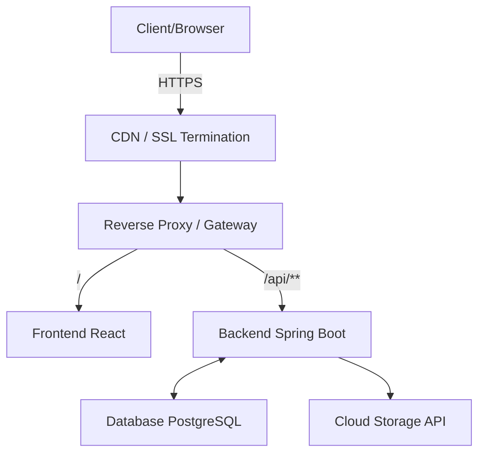
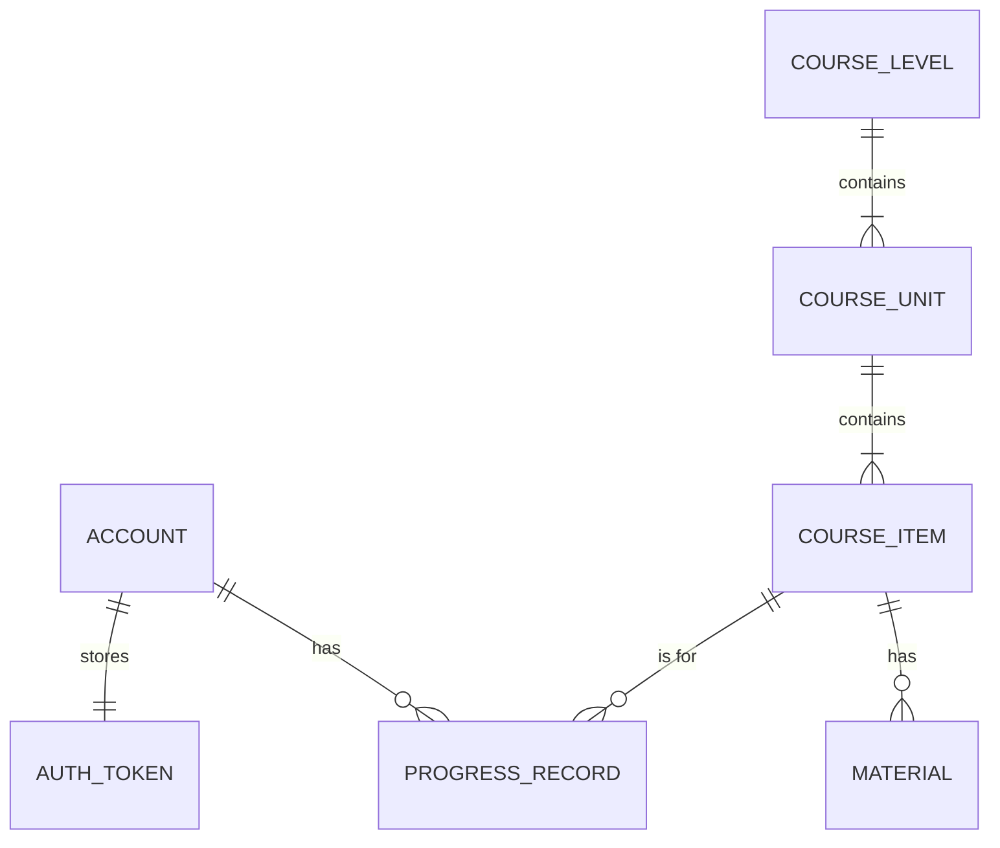
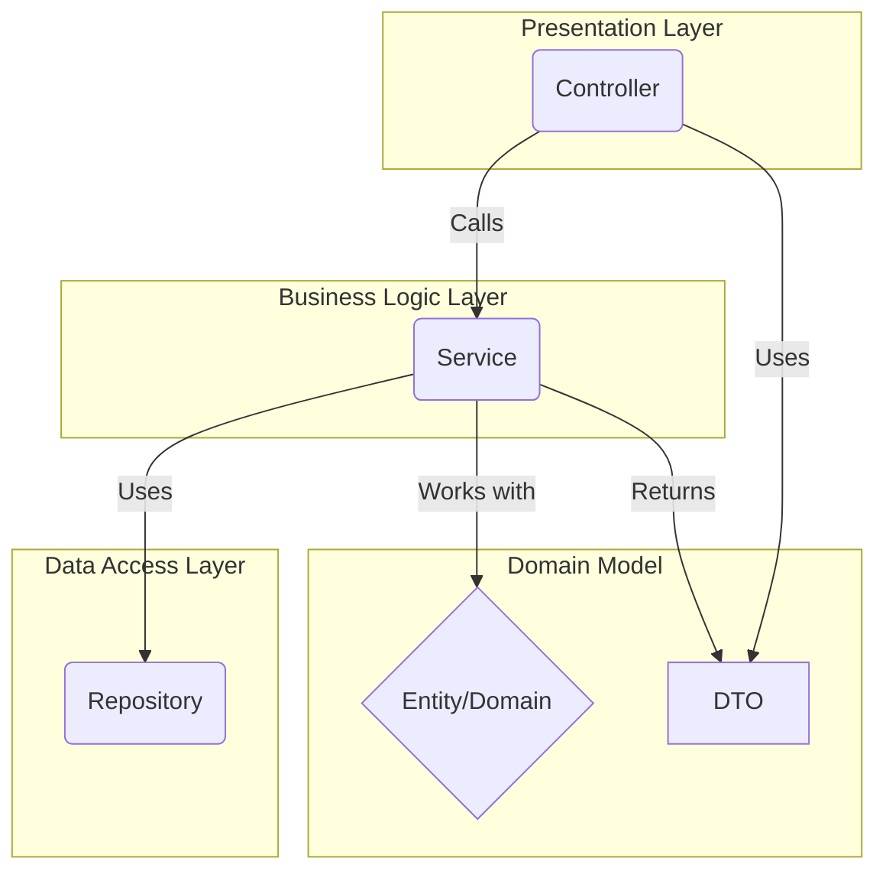

# Student Management App for Language Tutors

A full-stack web application designed to help language tutors manage their students, track lesson progress, and share educational materials efficiently.

---

## Overview

This project was developed to solve the real-world administrative challenges faced by language tutors. It automates repetitive tasks like lesson logging and homework distribution, allowing tutors to focus more on teaching. The application started as a backend practice project but evolved into a complete, full-stack solution following SDLC principles to manage its growing complexity, from requirements analysis and architecture design to deployment and maintenance on a self-hosted, containerized environment.

## Key Features

- **Role-Based Dashboards:** Tailored dashboards for Students and Teachers providing relevant overviews and management tools.
- **Hierarchical Curriculum View:** Displays the entire curriculum in a structured format, tracking each student's status (Completed, In Progress, Not Started).
- **Secure File & Link Sharing:** Integrates with cloud storage APIs for secure sharing of homework and class materials, supplemented by external web links.
- **Authentication & Authorization:** Secure login via Google OAuth2, with role-based access control (RBAC) managed by JWT.
- **Multi-language Support:** A fully internationalized (i18n) frontend supporting multiple languages.

## Screenshots

*(Visual demonstrations using placeholder or dummy data.)*

### 1. Teacher Dashboard – Student Management
- **Description:** Provides an overview of all students under the teacher’s supervision. Teachers can activate student accounts, assign lessons, and monitor progress.  
- **Screenshot/GIF / Video:** 
<video controls src="https://github.com/user-attachments/assets/1127c322-1967-40f1-97b2-5eb1c40e677e" width="600">
Your browser does not support the video tag.
</video>

### 2. Student Dashboard
- **Description:** Shows the student’s personal dashboard, including active lessons, progress tracking, and accessible materials. Only lessons started/released by the teacher are visible.  
- **Screenshot/GIF / Video:** 
<video controls src="https://github.com/user-attachments/assets/1c48ace6-18ca-44d5-b6d5-65a61dfdf8ab" width="600">
Your browser does not support the video tag.
</video>

### 3. Curriculum Hierarchy
- **Description:** Displays the full curriculum in a structured Level → Unit → Lesson view. Each lesson shows its status (Completed, In Progress, Not Started) for a selected student.  
- **Screenshot/GIF / Video:** 
<video controls src="https://github.com/user-attachments/assets/0b502953-0eb0-4e7a-84f5-40daa19d3f25" width="600">
Your browser does not support the video tag.
</video>

### 4. Authentication & Role Management
- **Description:** Shows login via Google OAuth2 and role-based access control. Demonstrates the difference between guest, student, and teacher views.  
- **Screenshot/GIF / Video:** 
<video controls src="https://github.com/user-attachments/assets/0328dc5e-1100-44bc-8636-dabc3038e33c
" width="600">
Your browser does not support the video tag.
</video>

## Architecture & Design

### Tech Stack

| Category      | Technology                               |
|---------------|------------------------------------------|
| **Frontend**  | React, TypeScript, React Router, Axios, Tailwind CSS   |
| **Backend**   | Java, Spring Boot, Spring Security (JWT & OAuth2) |
| **Database**  | PostgreSQL                               |
| **DevOps**    | Docker, Traefik, Cloudflare, Linux OS    |
| **Libraries** | QueryDSL, i18next, Google APIs, jjwt     |

### System Architecture

The application runs in a containerized environment, utilizing a CDN for SSL/TLS termination and a reverse proxy for routing internal traffic.

### Database Schema (ERD)

The database is designed around a normalized relational model to efficiently track student progress against the curriculum.

### Backend Layered Architecture

The backend follows a standard layered architecture, promoting separation of concerns and maintainability.

### API Design

The backend exposes a RESTful API designed around resources. Access is controlled via JWT and a robust role-based authorization mechanism to ensure users can only access permitted data.

## Technical Highlights & Optimizations

Beyond basic functionality, this project includes several key technical optimizations:

1.  **Backend Performance (N+1 Problem Solved):** The dashboard requires fetching a complex hierarchy of data. To avoid thousands of potential queries, a custom query with multiple `JOIN FETCH` statements was implemented, retrieving all necessary data in a single, optimized database call.

2.  **Efficient Data Processing:** A flat list of data returned from the database is efficiently processed and assembled into a nested, hierarchical structure within the service layer. This minimizes database load and leverages the power of in-memory processing.

3.  **Frontend Performance (Code Splitting):** The React application uses `React.Suspense` to enable code-splitting, ensuring that code for different pages is only loaded when needed. This significantly reduces the initial bundle size and improves the perceived loading speed.

4.  **Creative API Integration:** A key challenge was working around a cloud storage API's permission model to provide a seamless user experience. This was solved by developing a custom backend service that intelligently manages file and folder structures, demonstrating versatile problem-solving to achieve the desired outcome.

---
